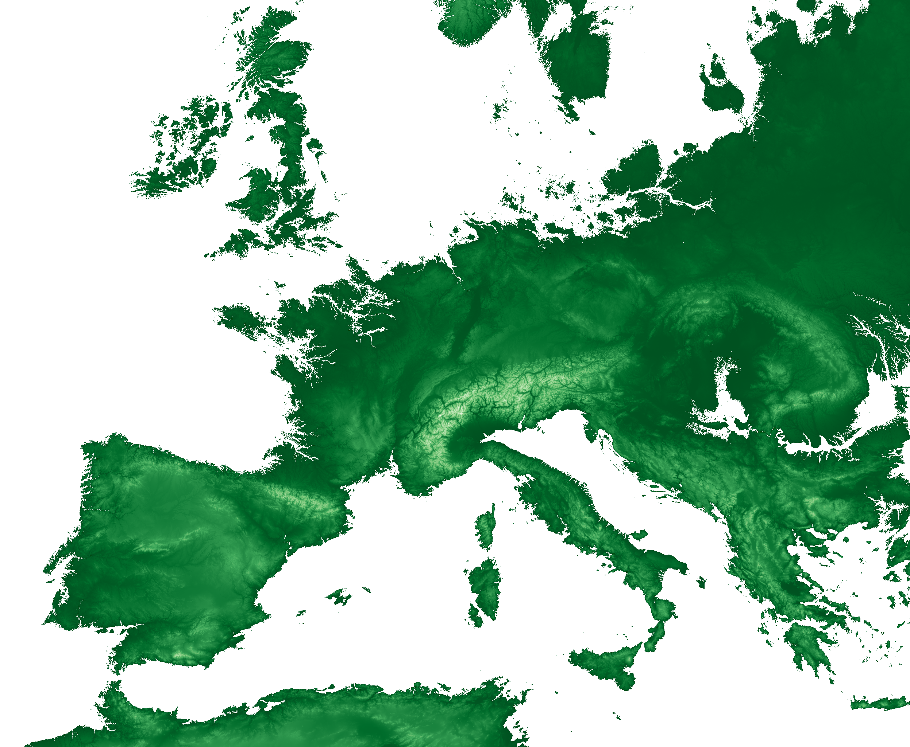
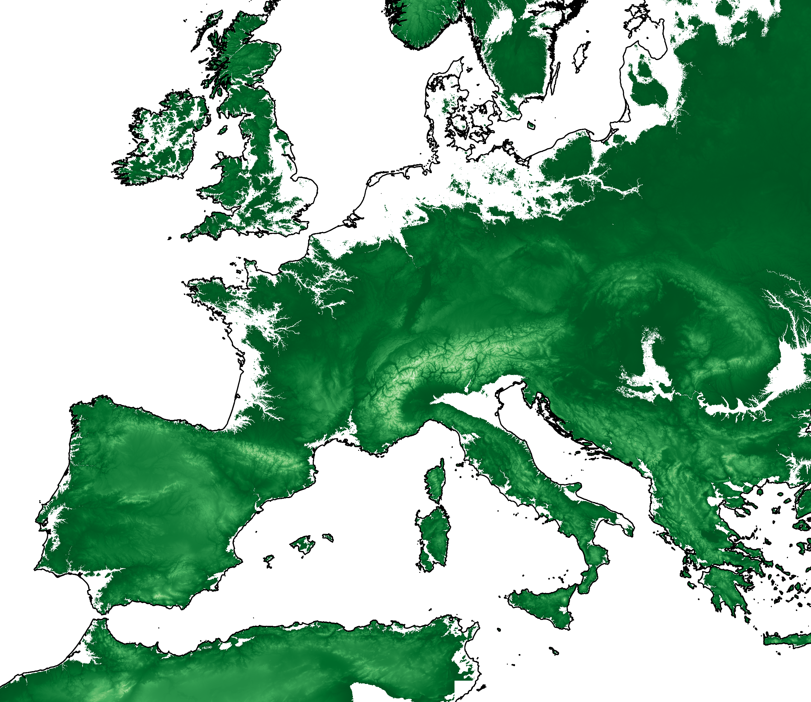
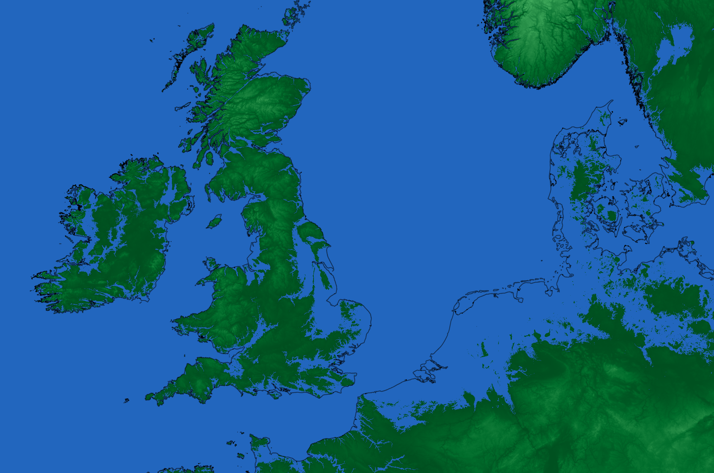
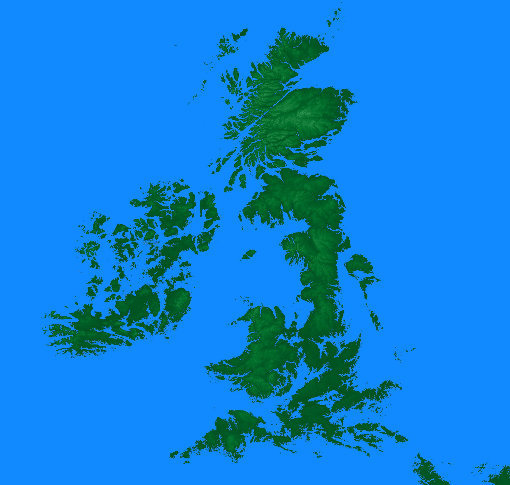

# elevation-map

One-day project using [NASA's SRTM dataset](https://cgiarcsi.community/data/srtm-90m-digital-elevation-database-v4-1/)
This data is available to download at : [http://srtm.csi.cgiar.org/srtmdata/](http://srtm.csi.cgiar.org/srtmdata/)

In addition, Europe's coastline was used, in shapefile format (available [here](https://www.eea.europa.eu/data-and-maps/data/eea-coastline-for-analysis-1/gis-data/europe-coastline-shapefile)

