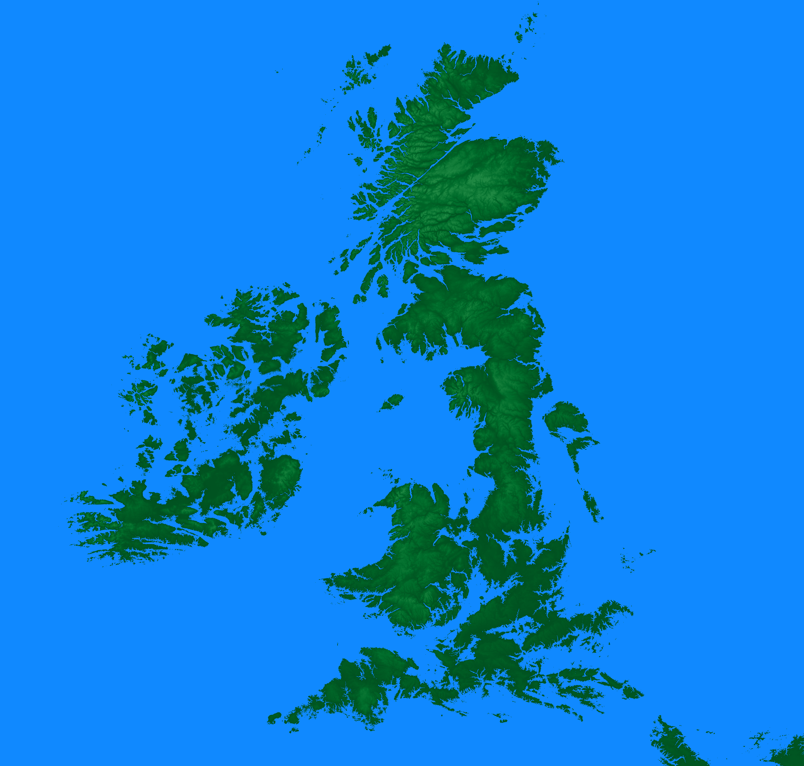

# elevation-map

One-day project using [NASA's SRTM dataset](https://cgiarcsi.community/data/srtm-90m-digital-elevation-database-v4-1/)
This data is available to download at : [http://srtm.csi.cgiar.org/srtmdata/](http://srtm.csi.cgiar.org/srtmdata/)

In addition, Europe's coastline was used, in shapefile format (available [here](https://www.eea.europa.eu/data-and-maps/data/eea-coastline-for-analysis-1/gis-data/europe-coastline-shapefile))

Northern sea figure was published to [r/MapPorn](https://www.reddit.com/r/MapPorn/comments/d4c5r9/map_of_a_flooded_northern_sea_sea_level_rise_of/) subreddit.

## Figures

### Europe (sea level rise of 80m)

### UK (sea level rise of 80m)

### Spain (sea level rise of 80m) 

### Northern Sea (sea level rise of 50m)

### Europe (sea level rise of 80m)

### Europe (sea level rise of 80m)

